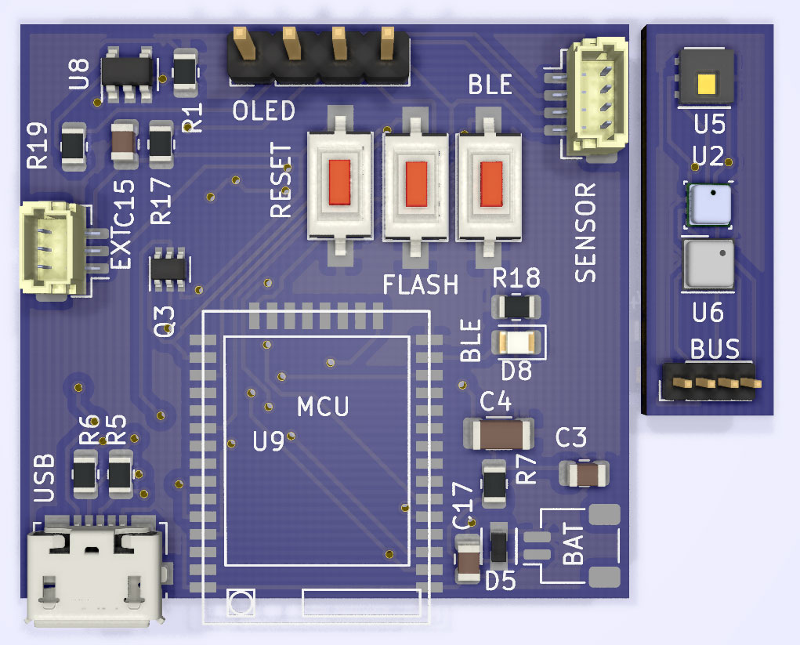
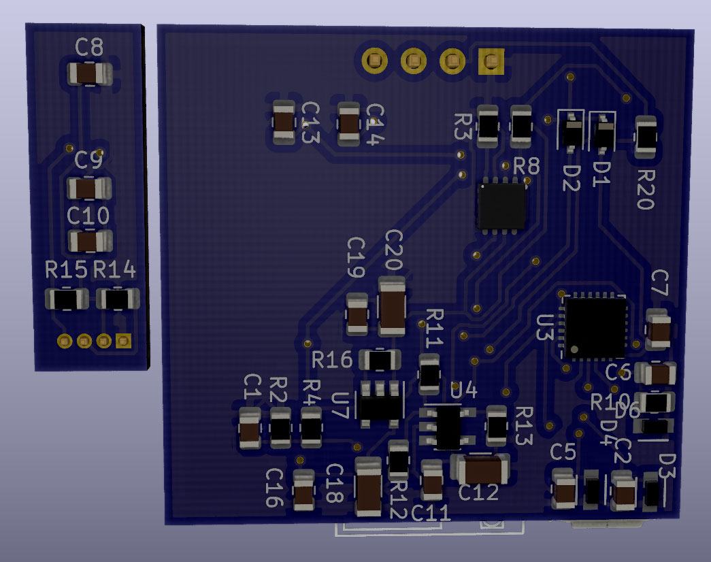
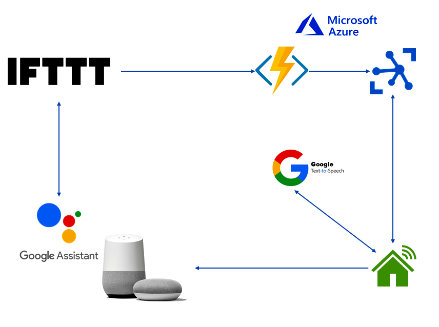

# Smart IoT Sensor (Google Home Speaker)

This project introduces proof of concept for a Smart Home Device/Sensor/Monitoring with a different approach.
In this project, Bosch & TI environment sensors (BMP280, BME280, BME680, HDC1080) were utilized to monitor the temperature, humidity, pressure, and air quality.

  

## What is innovative in this project

- The configuration process of the Smart IoT Sensor is straightforward and you can update it at anytime.
- The Sensor pushes real-time readings via BluetoothLE to multiple connected devices.
- Against many available solutions, you don't need to open a port in your router/modem/firewall. That's really cumbersome and may be secuirty issues.
- You don't need to deal with DNS and static IP address. that's a real pain.
- You don't need to register on expensive and complicated services (Azure IoT Hub service has a free plan).
- You can customize the whole project with a little effort.

## Components

This project includes the following components

- ESP32 (Smart IoT Sensor):

It's the main IoT device which basically is an ESP32 module connected to an environment sensor. The module needs to connect to the Internet via WiFi and connect to Azure services. This project is written in `Platform IO` so it should take care of everything (external libraries) if you use `Platform IO`.
You should be able to connect to the device and configure it via BluetoothLE and at any time, you can update the sensor configuration without any need to reset it.
WiFi name, Password, Azure Connection string, Google Home, device location (for example, kitchen, living room) are configuration values needed to be set. Hopefully, UWP and Xamarin applications will help you to do it with any challenges.

- UWP Application:

This application is just for configuring the Google Home node. It's basically a `Windows 10` application and will show up in `Windows store` soon :)
By the way, you can run on Desktop, Windows Mobile, and `Windows IoT Core` (`Raspberry Pi`).

- ~~Xamarin Application~~: (not ready yet)

This project is an extended version of UWP Application for `Android` and `iOS` platform. Not ready yet.

- Azure:

This is an Azure Function app if you want to use your own `Azure service`. contact me if you can't follow me.

## How set it up

- Google Home Node

First thing first, You need to build the Google Home Node device and program it.
I would recommend you first test it with a very basic ESP32 evaluation board and a BMP280/BME280 breakout board. This setup would cost you less than 5 USD. Of course, having a `SSD1306` is a plus.
Wire the sensor as is shown in the following figure and flash the board via Platform IO in `Visual Studio Code`.

  

You can always reconfigure the connection by changing the pin numbers in [config.h](ESP32/src/config.h).

You can also use the PCB design to make your custom compact module with more functionality and battery support.
Find the attached 3.5x3.5 cm [PCB design](/KiCad-Design/KiCad-Design.kicad_pcb).

PCB layout

  
  

- Azure IoT Hub

After creating the `Azure` account the first step is to make a new `IoT Hub` service in your Azure account. To do so just type in IoT Hub and create a new account (you pick F1 which is entirely free). Then Navigate to the IoT Hub service you created and make an IoT Device.
Click on the IoT Device that you have just created and copy the connection string. You need to set this connection string in your Google Home node.
To test if this part is working properly just send a direct method with the following payload and check the logs in your serial port.

{
  "Action": "Google Home",
  "UserID": "`YourUserID`",
  "Language": "en",
  "Key": "temperature"
}

So, now you are done with this part.

- Azure Function

In the same way make an `Azure Function App` service in your Azure account. Pick .Net 3.1 version and Free version in the Function App.
Open Azure project repository and update the _IoTHubName_, _IoTDeviceName_, and _IoTSharedAccessKey_ values and then Publish the function in your Azure account.
To test this step just copy the Function App **URL** and use postman to send a post message with the following body.

{
  "Action": "Google Home",
  "UserID": "`YourUserID`",
  "Language": "en",
  "Key": "temperature"
}

- IFTTT

You need to make an IFTTT account (it's free) and make a scenario called.
Try to create an applet in IFTTT, add `Google Assistant` as a trigger source. Remember to pick _say a phrase with a text ingredient_
Type in your preferred keywords followed by $ sign and provide a response for that.
Then pick `Webhooks` (web request) as the service. So copy and paste the `Azure Function App` URL from the previous step in URL field. You pick either Get or Post request and for the content type choose JSON. paste the following structure there.

{
  "Action": "Google Home",
  "Language": "en",
  "UserID": "`YourUserID`",
  "Key": "TextField"
}

## How it is working

The following figure shows the overal concept of the project.

  

The Google Home Node (main ESP32 module) starts to connect to Azure IoT service (as set in the configuration) and tries to find the local `Google Home speaker` (namely Google Home, Google Home Mini, or any Google Home enable speaker). It also drives the OLED and the sensor.
The Google Home Node is always in listening mode (at least for now) and doesn't send any information to `Azure IoT Hub`.

When you ask `Google Assistant` to give you the home temperature (or specific location/node), Google Assistant (not Google Home speaker) triggers an action in the IFTTT (which you have previously defined).

`IFTTT` triggers a webhook (better to an HTTP request) which actually an Azure Function with some inputs (username, keywords).
The received information from Azure Function is sent to the Azure IoT and eventually received by the Google Home Node.

Google Home Node would take action if the received information matches (username, location, etc.). So Google Home Node asks the Google Home speaker (already linked) to say the temperature, humidity, ... values.
I used [esp8266 Google TTS](https://github.com/horihiro/esp8266-google-tts) to generate an audio file and [esp8266 Google Home Notifier](https://github.com/horihiro/esp8266-google-home-notifier) to push the message/notification to the Google Home Speaker.

## Platform/IDE(s)

- [Platform IO](https://platformio.org/)
- [Arduino](https://www.arduino.cc/)
- [Espressif ESP-32](https://www.espressif.com/en/products/socs/esp32)

## Supported Sensors

- [Bosch BMP280](https://www.bosch-sensortec.com/products/environmental-sensors/pressure-sensors/bmp280/)
- [Bosch BME280](https://www.bosch-sensortec.com/products/environmental-sensors/humidity-sensors-bme280/)
- [Bosch BME680](https://www.bosch-sensortec.com/products/environmental-sensors/gas-sensors/bme680/). You need a [permission](https://www.bosch-sensortec.com/media/boschsensortec/downloads/bsec/2017-07-17_clickthrough_license_terms_environmentalib_sw_clean.pdf) to use [Bosch Sensortec Environmental Cluster(BSEC) Library](https://github.com/BoschSensortec/BSEC-Arduino-library). Please visit this [page](https://www.bosch-sensortec.com/software-tools/software/bsec/)
- TO DO: [Texas Instrument HDC1080](https://www.ti.com/lit/ds/symlink/hdc1080.pdf)

## Dependent Libraries

- [Azure IoT Arduino](https://github.com/Azure/azure-iot-arduino)
- [Azure IoT Protocol HTTP](https://github.com/Azure/azure-iot-arduino-protocol-http)
- [Azure IoT Protocol MQTT](https://github.com/Azure/azure-iot-arduino-protocol-mqtt)
- [Azure IoT Utility](https://github.com/Azure/azure-iot-arduino-utility)
- [NimBLE Arduino](https://github.com/h2zero/NimBLE-Arduino) - Lite version of the BluetoothLE to save some RAM
- [esp8266 Google Home Notifier](https://github.com/horihiro/esp8266-google-home-notifier) - Customized version to support different languages.
- [esp8266 Google TTS](https://github.com/horihiro/esp8266-google-tts)
- [Adafruit BME280 Library](https://github.com/adafruit/Adafruit_BME280_Library) - Locally/Modified in the project
- [ThingPulse SSD1306](https://github.com/ThingPulse/esp8266-oled-ssd1306) - Extensively modified and locally imported.
- [BSEC Arduino Library](https://github.com/BoschSensortec/BSEC-Arduino-library)

## Future Improvment

- Supporting TI HDC1080
- Improving the UWP Application layout and code logic
- Deploy UWP App in the Windows Store
- Support for Android & iOS platforms (Xamarin Forms)
- Support for handling User & sensor location
- Multi-language support (EN, DE, FR)
- Find a way to integrate with Google Assistant
- Connect to [HASS](https://www.home-assistant.io/)
